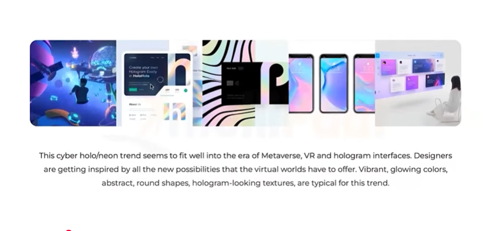

**Trends of product design**

1. **Holographic/Neon**  
	This trend features vibrant, iridescent colors and glowing neon effects that create a futuristic and eye-catching aesthetic. Holographic and neon designs are often used to grab attention and convey innovation, especially in tech and entertainment products.  
	

2. **Eco-Conscious "Cardboard" Style**  
	Inspired by sustainability, this style uses earthy tones, recycled textures, and minimalistic layouts to reflect environmental awareness. It often incorporates kraft paper backgrounds, green accents, and hand-drawn elements to emphasize eco-friendly values.

3. **Wild Typography**  
	This trend breaks traditional typography rules by using bold, experimental fonts, irregular spacing, and dynamic layouts. Wild typography adds personality and energy to designs, making them stand out and communicate a strong brand voice.

4. **Claymorphism 3D**  
	Claymorphism uses soft, rounded 3D shapes with subtle shadows and pastel colors, giving interfaces a playful and tactile feel. This trend makes digital products appear more approachable and engaging, often used in apps and websites targeting younger audiences.

5. **Neomorphism**  
	Neomorphism blends skeuomorphism and flat design, using soft shadows and highlights to create elements that appear extruded or inset. This subtle 3D effect gives interfaces a modern, minimalistic look while maintaining depth and usability.