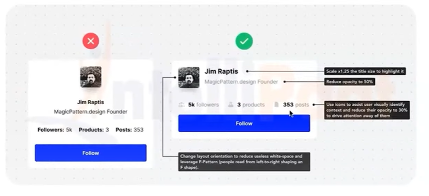
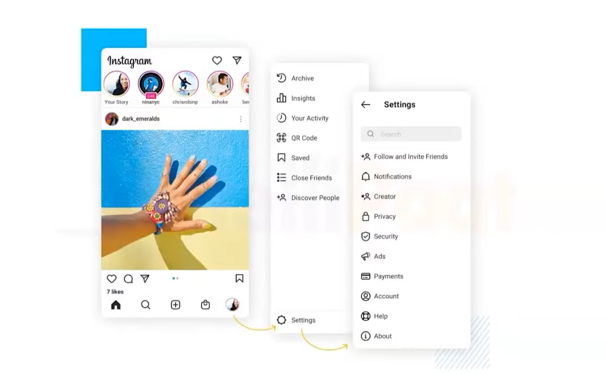
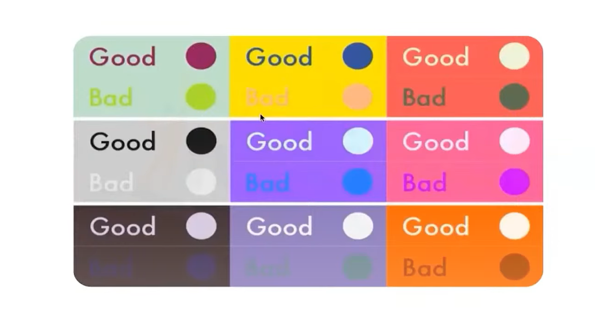

1. **Hierarchy** -   
   Organizes content so users can easily distinguish the most important elements from less important ones.

2. **Progressive Disclosure** -   
    Shows only necessary information at first, revealing more details as needed to avoid overwhelming users.

3. **Consistency** -   
    Maintains uniformity in design elements and behaviors, making interfaces predictable and easier to use.

4. **Contrast** -   
    Uses differences in color, size, or shape to make important elements stand out and improve readability.

5. **Proximity** -   
    Groups related items together to visually indicate their relationship and improve information organization.